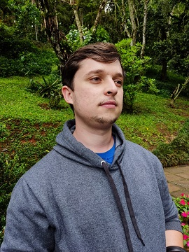

# Minha Bio

## Dados

* _Nome_: Chrystian Arriel Amaral
* _Função_: Analista de Desenvolvimento de Sistemas
* _Graduação_: Bacharel em Ciencia da Computação
* _Universidade_: UFLA

## Experiência Profissional

* **BITKA Analytics** - Lavras, MG (Agosto de 2021 - Presente)
  * Analista de Desenvolvimento de Sistema Junior (Agosto de 2021 - Presente)
    * Metodologia scrum.
    * Atividades full stack em tecnologias como Spring Boot, Angular, .NET, entre outras.
    * Criação de framework de componentes front-end e custom template application.
    * Atividades de Engenharia de Dados para desenvolvimento cloud em colaboração com a empresa Stone.
* **Agência Zetta** - Lavras, MG (Dezembro de 2020 - 2021)
  * Estagiário de Desenvolvimento de Sistemas (Maio de 2021 - Agosto 2021)
    * Metodologia scrum.
    * Atividades full stack em tecnologias como Java, Spring Boot, Play Framework, AngularJS, Angular, PostgreSQL, Oracle e Git.
  * Bolsista de Desenvolvimento de Sistemas (Novembro 2020 - Maio 2021)
    * Metodologia scrum.
    * Atividades full stack em tecnologias como Java, Spring Boot, Play Framework, AngularJS, Angular, PostgreSQL, Oracle e Git.
    * Desenvolvedor de sistemas no ZettaLab 2020 (programa de extensão), com o tema "Gestão e Rastreabilidade na Pecuária". Responsável pelo desenvolvimento de sistema backend da plataforma Cadastro Positivo do Pecuarista.

## Atividades Acadêmicas 

* Centro Acadêmico de Ciência da Computação (Coordenador)
* Colegiado de Extensão e Cultura do ICET/UFLA (Representante Discente)
* Conselho do Departamento de Ciência da Computação (Representante Discente)
* Grupo de Estudos em PLN e IA

## Cursos

* Google Cloud Computing Foundations: Cloud Computing Fundamentals (Google Cloud Skills Boost - 6 de outubro de 2022)
* Google Cloud Platform (GCP) do Zero ao Avançado (Udemy - 14 de dezembro de 2021)
